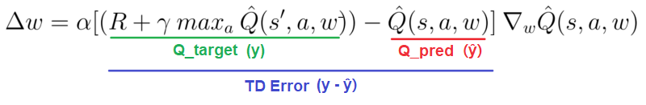

# Deep Q-Network for OpenAI's Lunar Lander (PyTorch)

## Result

## Lunar Lander Environment ([source](https://github.com/openai/gym/blob/master/gym/envs/box2d/lunar_lander.py)) ##

**STATE** : `[position_x,   position_y,               vel_x,                 vel_y,
                angle,    angular_v,   left_leg_on_groud,   right_leg_on_ground]`
                   
**ACTION** : `[Do Nothing,   fire left engine,   main engine,   right engine]` - Discrete(4)
    
**REWARD** : 
* moving from top of the screen to landing pad at (0,0) @ zero speed : +100..140 
* If lander moves away from landing pad, it loses reward back
* Episode finish w. lander crashing       : -100 
* Episode finish w. lander coming to rest : +100
* Each leg ground contact                 : +10
* Firing main engine                      : -0.3/frame
* Solved                                  : +200 

## DQN was implemented with following tricks:

* **Fixed Q-target** : separate local & target networks
* **Experience Replay** : Having a buffer of (state, action, reward, next_state, done) tuples to sample from 
* **Double DQN** : using target network to evaluate the model- when choosing action maximizing action-value function 
* **ε-greedy Policy** : choosing non-greedy action with probability = ε (starts at 1 and decays to 0 each episode) 

## Weight Update formula for DQN: 

## Hyperparameters

* **n_episodes** : 4000
* **model architecture** : 2 fully connected layers (h=32)
* **reply buffer capacity** : 100,000 tuples
* **batch size** : 64       
* **discount rate, γ** : 0.99    
* **soft update factor, τ** (for target network params) : 0.001 1e-3     
* **learning rate** : 0.0005               
* **update weights every** 4 episode steps 

*Final model checkpoint producing above simulation is in `models/` folder.*

## Sources
* [Original DQN Paer from DeepMind](https://storage.googleapis.com/deepmind-media/dqn/DQNNaturePaper.pdf)
* [Udacity's Deep Reinforcement Learning Nanodegree](https://classroom.udacity.com/nanodegrees/nd893/dashboard/overview)
